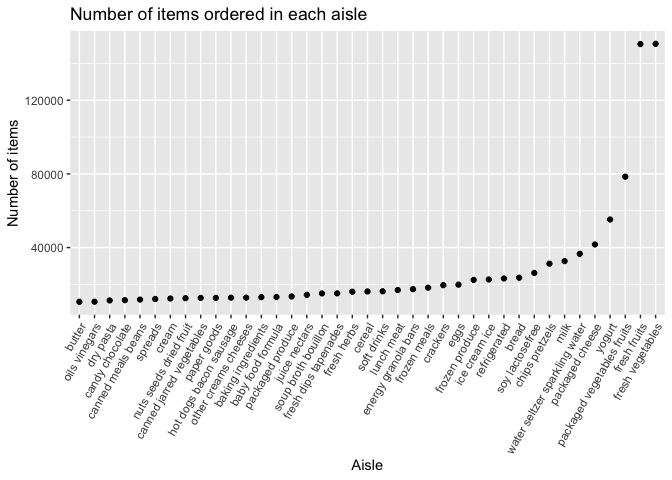

p8105_hw3_mwd2126
================
Michael Denham
2022-10-17

\#Problem 1

First, I begin by loading the data set.

``` r
data("instacart")
instacart = as_tibble(instacart)
```

The data set `instacart` has 1384617 rows and 15 columns. The data set
lists items ordered by customers in a long format, with each item
getting its own row. Key variables include order_number, aisle_id,
department_id, and variables related to the time of the order.

There are 134 aisles. To find which aisles the most items are from, I
will build a list of the aisles in order of most items to fewest items.

``` r
instacart %>% 
  count(aisle) %>% 
  arrange(desc(n))
```

    ## # A tibble: 134 × 2
    ##    aisle                              n
    ##    <chr>                          <int>
    ##  1 fresh vegetables              150609
    ##  2 fresh fruits                  150473
    ##  3 packaged vegetables fruits     78493
    ##  4 yogurt                         55240
    ##  5 packaged cheese                41699
    ##  6 water seltzer sparkling water  36617
    ##  7 milk                           32644
    ##  8 chips pretzels                 31269
    ##  9 soy lactosefree                26240
    ## 10 bread                          23635
    ## # … with 124 more rows

Based on this table, the most items are ordered from the fresh produce
aisles.

Let’s look solely at aisles with more than 10,000 items ordered.

``` r
instacart %>% 
  count(aisle) %>%
  filter(n > 10000) %>% 
  arrange(desc(n)) %>%
  mutate(aisle = fct_reorder(aisle, n)) %>% 
  ggplot(aes(x = aisle, y = n)) + 
  geom_point() +
  labs(title = "Number of items ordered in each aisle", x = "Aisle", y = "Number of items") +
  theme(axis.text.x = element_text(angle = 60, hjust = 1))
```

<!-- -->

Then I’ll make a table of the three most popular items in the baking
ingredients, dog food care, and packaged vegetables aisles.

``` r
instacart %>% 
  filter(aisle==c("baking ingredients", "dog food care","packaged vegetables fruits")) %>% 
  group_by(aisle) %>%
  count(product_name) %>%
  mutate(rank = min_rank(desc(n))) %>% 
  filter(rank < 4) %>%
  arrange(desc(n)) %>%
  knitr::kable()
```

| aisle                      | product_name                                    |    n | rank |
|:---------------------------|:------------------------------------------------|-----:|-----:|
| packaged vegetables fruits | Organic Baby Spinach                            | 3324 |    1 |
| packaged vegetables fruits | Organic Raspberries                             | 1920 |    2 |
| packaged vegetables fruits | Organic Blueberries                             | 1692 |    3 |
| baking ingredients         | Light Brown Sugar                               |  157 |    1 |
| baking ingredients         | Pure Baking Soda                                |  140 |    2 |
| baking ingredients         | Organic Vanilla Extract                         |  122 |    3 |
| dog food care              | Organix Grain Free Chicken & Vegetable Dog Food |   14 |    1 |
| dog food care              | Organix Chicken & Brown Rice Recipe             |   13 |    2 |
| dog food care              | Original Dry Dog                                |    9 |    3 |

Next I’ll make a table showing the mean hour of the day at which Pink
Lady Apples and Coffee Ice Cream are ordered on each day of the week.

``` r
instacart %>% 
  filter(product_name==c("Pink Lady Apples", "Coffee Ice Cream")) %>%
  group_by(product_name, order_dow) %>% 
  summarize(mean_hr = mean(order_hour_of_day)) %>% 
  spread(order_dow, mean_hr) %>%
  knitr::kable()
```

    ## Warning in product_name == c("Pink Lady Apples", "Coffee Ice Cream"): longer
    ## object length is not a multiple of shorter object length

    ## `summarise()` has grouped output by 'product_name'. You can override using the
    ## `.groups` argument.

| product_name     |        0 |        1 |        2 |       3 |        4 |        5 |        6 |
|:-----------------|---------:|---------:|---------:|--------:|---------:|---------:|---------:|
| Coffee Ice Cream | 13.22222 | 15.00000 | 15.33333 | 15.4000 | 15.16667 | 10.33333 | 12.35294 |
| Pink Lady Apples | 12.25000 | 11.67857 | 12.00000 | 13.9375 | 11.90909 | 13.86957 | 11.55556 |

\#Problem 2
